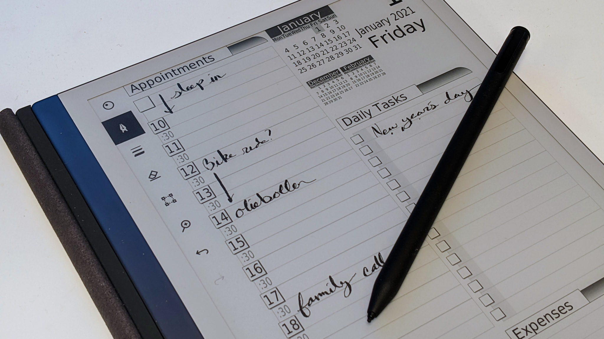

# Dynamic Templates



This is a copy of the `D*I*Y` Planner Dynamic Template application
that was posted to [diyplanner.com/node/6210](https://web.archive.org/web/20160321035719/http://www.diyplanner.com/node/6210?page=1)
back in 2009, but lost when the website was reorganized sometime later.  Luckily the announcement and the
[source code](https://web.archive.org/web/20160321035719/http://www.diyplanner.com/files/Dynamic%20Templates%20v2.05a%20source.zip)
were crawled by the Internet Archive, so it was possible to save it.  An example of the page-per-day, "DIY3 Right Hand Style" template formatted for the reMarkable2 e-ink tablet is in [example-diy-planner.pdf](example-diy-planner.pdf).

## Build instructions

The 2009 code was updated to work with Qt5 on Ubuntu 18.04.  To build the `diyp` executable:

```
qmake
make
```

## Dynamic Templates v2.05 announcement

This is a copy of the [original post](https://web.archive.org/web/20160321035719/http://www.diyplanner.com/node/6210?page=1):

The `D*I*Y` Planner Dynamic Template application has now hit version 2.0, ready to produce any size and shape of yearly, monthly, weekly, and daily calendars for your printing pleasure. All designs are based upon the Classic versions of the `D*I*Y` Planner, along with input from Doug, and so will integrate completely into your DiyP setup. (The daily design was created by Doug, but was never implemented as a static template owing to the insane amount of repetitive work required.)

Simply select your paper size, choose the calendar type, and tweak the settings to come up with your own printable set of calendars that perfectly fit your planner and your lifestyle.

The Mac version was built in Mac OS 10.4.11, using Qt 4.5.2

This is multi-platform software. Below are download links for pre-built, static, binary applications for both Windows and Mac OS X as well as the source code. Through the Nordic Magic of the Qt Libraries, both of these applications were built from the same source code. This source can be built on any platform supported for Qt 4.5.2

### Some Major Changes:

* One application instead of many. The initial merge was a pain, but once established, adding new templates is now far easier. This release replaces all of the individual Calender-type Dynamic Templates, which will be disappearing in the near future.
* No Printing, Only PDF and SVG. Details below.
* ANY Page size, Painlessly. I included the major US and European page sizes along with a Custom Page Size control. The Qt feature that lets me do this was new to Qt 4.4

I would like to believe the application is intuitive easy to use, but what I call easy may not be so for other folks, so here are some basic instructions.

* Be sure you have the font "Blue Highway" installed as it is hard coded into the application
* Use the "Page Size" tab to set paper size and margins
* Use the calendar widget and the First/Last selectors to set your page range.
* The Qt date widget is a bit non-intuitive. Here's how to "do it". (I'm doing this a step at a time with a copy of the application running as I type this - Two Pages per Day template - originally posted 30 May 2008) The default date selection is today for both first/last. The widgets are set so that the last day must be AFTER the first day, so you should start by setting the LAST day.
* Click on "May" in "Last Day" then click the up-arrow once. Last Day should now read "June 30,2008".
* Click on the "1" which is June 1st to set the displayed date to June 1, 2008
* To set the "First Day", decrement the day from May 30 to May 1, then increment the month from May to June.
* Now the range is June 1 to June 30.
* If you do not like the way this works, complain to Trolltech, the makers of Qt.

* Set your line width and Line Spacing with the "Line Spacing and Thickness" tab. Try tinkering with a custom line spacing on the templates that have blocks of lines. The spacing is done as multiples of a single line and that can leave blank space at the page bottom
* No printing, just PDF or SVG. For multi-page PDF output, you can use the "File" menu or just type [Control-S(Win)/ Command-S(Mac)] This is, I hope, a temporary thing. At the last minute, I ran into difficulty between the parts that "draw" to a printer versus the parts that "draw" to a PDF document. I decided to just pull the print feature rather than delay the release. We have figured out how to arrange and rearrange PDF's for double-sided (duplex) printing:
* Arrange Pages for 2-Up Duplex Printing
  * Dynamic Templates and Multivalent: Example 1 - January 2008 classic booklet
  * Dynamic Templates and Multivalent: Example 2 - A 2 year classic booklet
* Graphic output in SVG format. Be careful: It makes one file per page. [Control-P(Win)/ Command-P(Mac)] SVG is Scaled Vector Format. An open source equivalent of the file format used by Adobe Illustrator. There is a freeware application called Inkscape you can use to edit the shape and color of any generated template page.
* The "Controls" are in what Qt calls a dock. It can be detatched to be a floating window or it can be hidden. To the right of the word "Controls" you see two small icons. The left had one "un-docks" the controls and the right hand one will hide it. To re-dock the window, double-click on the window's title bar - where the word "Controls" is. To un-hide it, use the "View" menu on the menu bar (On the application window for Windows, at the top of the screen for Macs)

Please let me know if you encounter problems. I do not consider this totally finished. There are refinements to be made, but it is, I believe, Ready for Prime Time.

### License
License granted to me (Dan White) by Douglas Johnston to duplicate the D*I*Y Planner forms look and feel under the Creative Commons NC-ND License. The source code is declared under GNU GPL.

### Language
That's part of the Nordic Magic. Qt allows one to make an application multi-lingual. If you want to add a language, All I need is a list of words and phrases translated and they can easily be added to the application.

### Current known problems:
None (yet). My goal is to add direct printing and the ability to save into a graphic format (SVG or PNG or something).

### Version History:

* 2.0: Initial Release
* 2.01:
  * Bug 01 - Full date range not "printing"
  * Bug 02 - Second pages not "printing"
* 2.02: Bug 03 - month display, 5th week/first day comes up as "1"
* 2.03: Bug 04 - line spacing added to 2 pages per week and 2 pages per month -- AND !! -- Notes !
* 2.04: Bug 05 - 2 page per month inner/outer margins reversed on right hand page
Plus !! two added goodies !! - I added an interactive label to the pen/line thickness control and I added a Progress Dialog to let you see your PDF's being generated.
* 2.05: 6 new templates, a credit line, and SVG output. The new templates are:
  * One Page Per Day: Daily Journal pages -- Lined, Grid, and Blank
  * Two Pages per Month - Landscape. I did this on 11 by 17 inch paper for a wall calendar !
  * Two Pages per Week - one Portrait and one Landscape done in a minimal style inspired by Moleskine

### Paper Sizes:

I originally wanted to include all the following in the application, but was asked to remove it to avoid legal issues. The info is important for folks using commercial binders, so I feel safe including it like this:

#### Franklin-Covey Page Sizes:
* Pocket	  	3 x 5 inches
* Compact	  	4.25 by 6.75 inches
* Classic	  	5.5 by 8.5 inches
* Monarch	  	8.5 by 11 inches

#### Filofax Page Sizes:
* Mini	  	67 by 105 mm
* Compact/Slimline/Personal	  	95 by 171 mm
* Pocket	  	81 by 120 mm

#### Levenger Circa Page Sizes:
* Micro PDA	  	2 by 3.5 inches
* PDA	  	3 by 5 inches
* Compact	  	3.75 by 6.75 inches
* Junior	  	5.5 by 8.5 inches
* Letter	  	8.5 by 11 inches

